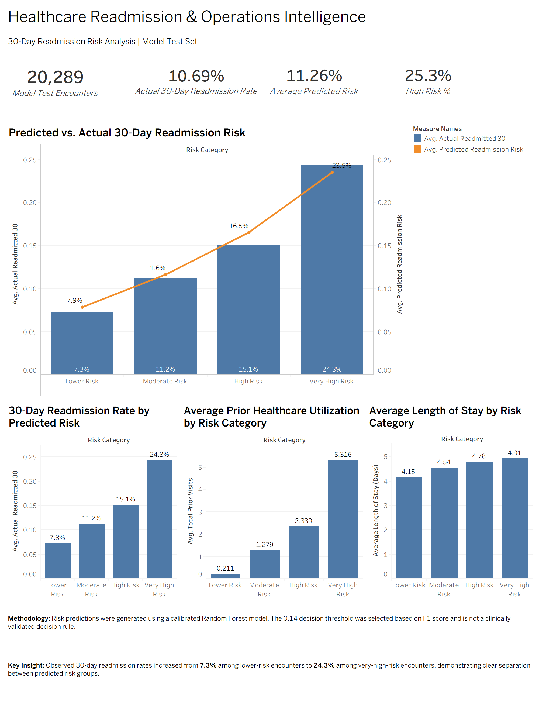
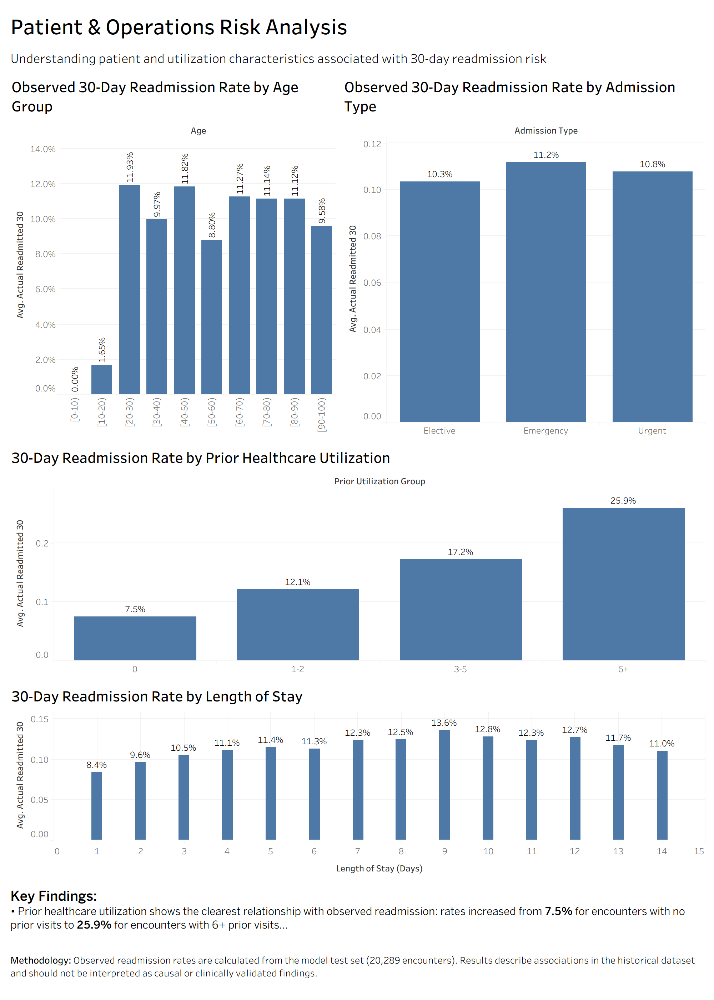

# Healthcare Operations & Patient Outcome Intelligence

An end-to-end healthcare data science project that analyzes **30-day hospital readmission**, identifies patterns associated with higher observed readmission rates, develops a calibrated machine learning risk model, and delivers interactive Tableau dashboards for operational analysis.

The project combines **Python, PostgreSQL, SQL, scikit-learn, XGBoost, SHAP, Tableau, and Git/GitHub** across the full workflow—from raw data preparation and statistical analysis through model development, interpretation, and stakeholder-facing visualization.

## Key Findings

| Finding                              | Result                                  |
| ------------------------------------ | --------------------------------------- |
| Patient-level test set               | **14,304 patients / 20,289 encounters** |
| Random Forest ROC-AUC                | **0.6438**                              |
| Random Forest PR-AUC                 | **0.2005**                              |
| Recall at selected 0.14 threshold    | **43.6%**                               |
| Precision at selected 0.14 threshold | **17.9%**                               |
| F1 score at selected 0.14 threshold  | **0.254**                               |
| High + Very High Risk encounters     | **26.0% of test encounters**            |
| Strong recurring signal              | **Prior healthcare utilization**        |

The results are based on a **held-out patient-level test set**. Model outputs are intended for analytical and decision-support purposes rather than clinical diagnosis or treatment decisions.

## Business Problem

Hospital readmissions can create operational challenges for healthcare organizations, including increased demand for inpatient resources and difficulty planning beds and staffing.

This project investigates three questions:

* Which patient and healthcare utilization characteristics are associated with observed 30-day readmission?
* How effectively can historical encounter information identify encounters with elevated readmission risk?
* How can analytical and model results be translated into dashboards that are useful for operational audiences?

## Dataset

This project uses the **Diabetes 130-US Hospitals for Years 1999–2008** dataset, which contains approximately 101,000 hospital encounters from multiple U.S. hospitals.

The dataset includes information about demographics, diagnoses, admission characteristics, medications, prior healthcare utilization, and hospital stay details.

For this project, the target variable was transformed into a binary outcome:

* **1** = readmitted within 30 days (`<30`)
* **0** = not readmitted within 30 days

The modeling workflow focuses on encounter information used as predictive features. Direct patient and encounter identifiers such as `patient_nbr` and `encounter_id` were not used as model features.

## Project Objectives

1. **Prepare and transform the data** for reliable analysis and modeling.
2. **Use SQL and PostgreSQL** to organize, summarize, and analyze healthcare encounter data.
3. **Perform exploratory data analysis** to identify patterns in readmission and healthcare utilization.
4. **Engineer meaningful features** such as prior utilization, prior inpatient visits, diagnosis categories, and encounter-complexity indicators.
5. **Build and evaluate machine learning models** for 30-day readmission risk.
6. **Calibrate predicted probabilities** and evaluate decision thresholds for the imbalanced classification problem.
7. **Interpret model behavior** using SHAP-based feature analysis.
8. **Communicate findings through Tableau** dashboards for operational and analytical audiences.

## End-to-End Workflow

The project follows a structured data science workflow:

```text
Raw Healthcare Data
        ↓
Data Cleaning & Preparation
        ↓
PostgreSQL / SQL Transformation
        ↓
Exploratory Data Analysis
        ↓
Feature Engineering
        ↓
Patient-Level Train/Test Split
        ↓
Machine Learning Modeling
        ↓
Probability Calibration
        ↓
Decision Threshold Analysis
        ↓
SHAP Model Interpretation
        ↓
PostgreSQL Risk Tables & Views
        ↓
Tableau Analytics Dashboards
```

## Technology Stack

| Technology       | Purpose                                                                                                 |
| ---------------- | ------------------------------------------------------------------------------------------------------- |
| **Python**       | Data preparation, exploratory analysis, statistical analysis, feature engineering, and machine learning |
| **pandas**       | Data manipulation and cleaning                                                                          |
| **NumPy**        | Numerical operations and data processing                                                                |
| **SciPy**        | Statistical analysis and hypothesis testing                                                             |
| **scikit-learn** | Preprocessing, model development, evaluation, calibration, and threshold analysis                       |
| **XGBoost**      | Gradient-boosted model comparison                                                                       |
| **SHAP**         | Model interpretability and feature contribution analysis                                                |
| **PostgreSQL**   | Data storage, SQL transformations, analytical views, and prediction analysis                            |
| **Tableau**      | Interactive dashboards and stakeholder-facing visualization                                             |
| **Git / GitHub** | Version control and reproducible project development                                                    |

## Technology Stack

| Technology       | Purpose                                                                                                 |
| ---------------- | ------------------------------------------------------------------------------------------------------- |
| **Python**       | Data preparation, exploratory analysis, statistical analysis, feature engineering, and machine learning |
| **pandas**       | Data manipulation and cleaning                                                                          |
| **scipy**        | Statistical analysis and hypothesis testing                                                             |
| **scikit-learn** | Model development, evaluation, preprocessing, and calibration                                           |
| **XGBoost**      | Gradient-boosted machine learning model comparison                                                      |
| **SHAP**         | Model interpretability and feature contribution analysis                                                |
| **PostgreSQL**   | Data storage, SQL transformations, analytical views, and prediction results                             |
| **Tableau**      | Interactive dashboards and stakeholder-facing visualization                                             |
| **Git / GitHub** | Version control and project collaboration                                                               |

## Reproducibility

The project is designed so that the core data preparation and modeling workflow can be reproduced on another machine without relying on machine-specific file paths.

### 1. Clone the repository

```bash
git clone https://github.com/eshet018-commits/healthcare-intelligence.git
cd healthcare-intelligence
```

### 2. Create a Python environment

Windows:

```powershell
python -m venv .venv
.venv\Scripts\activate
```

macOS/Linux:

```bash
python3 -m venv .venv
source .venv/bin/activate
```

### 3. Install dependencies

```bash
python -m pip install --upgrade pip
pip install -r requirements.txt
```

### 4. Add the dataset

Download the **Diabetes 130-US Hospitals for Years 1999–2008** dataset and place the raw CSV at:

```text
data/raw/diabetic_data.csv
```

The raw healthcare dataset is intentionally excluded from version control.

### 5. Run the data-preparation workflow

```bash
python -m src.data_preparation
```

This creates:

```text
data/processed/diabetic_clean_stage1.csv
```

### 6. Run feature engineering

```bash
python -m src.feature_engineering
```

This creates:

```text
data/processed/diabetic_features.csv
```

### 7. Run the modeling pipeline

```bash
python -m src.run_pipeline
```

The pipeline performs a patient-level 80/20 train/test split, trains the Random Forest model, calibrates its probabilities using sigmoid calibration, evaluates the selected 0.14 decision threshold, and generates model artifacts and analytical reports.

Generated outputs include:

```text
models/
├── random_forest.joblib
├── calibrated_random_forest.joblib
└── rf_preprocessor.joblib

reports/
├── model_performance.csv
├── risk_category_summary.csv
└── rf_feature_importance.csv
```

The generated datasets and model artifacts are excluded from version control because they can be recreated from the documented workflow.

### 8. Reproduce the exploratory analysis

Open:

```text
notebooks/01_end_to_end_readmission_analysis.ipynb
```

The notebook contains the exploratory analysis, statistical investigation, model comparison, calibration analysis, SHAP interpretation, and Tableau preparation workflow.

### PostgreSQL and Tableau

The SQL scripts in `sql/` contain the analytical queries and views used for the PostgreSQL portion of the project.

The Tableau workbook is located at:

```text
tableau/Healthcare_Readmission_Intelligence.twb
```

PostgreSQL credentials are not stored in the repository. A local database connection must be configured separately when reproducing the database portion of the workflow.

## Project Structure

```text
healthcare-intelligence/
│
├── data/
│   ├── raw/
│   └── processed/
│
├── models/
│
├── sql/
│
├── src/
│
├── tableau/
│   └── Healthcare_Readmission_Intelligence.twb
│
├── README.md
└── .gitignore
```

Raw and processed CSV data are excluded from version control where appropriate to keep the repository focused on reproducible code, analytical logic, model artifacts, and documentation.

## Data Preparation

The raw dataset required several preprocessing steps before analysis and modeling.

Key preparation steps included:

* Replaced the dataset's `?` placeholders with missing values.
* Standardized missing categorical values into meaningful categories such as `Unknown` and `Not Measured`.
* Removed the `weight` feature because of substantial missingness.
* Converted the age ranges into numeric midpoint values for modeling.
* Verified data types, missing values, and categorical consistency.
* Excluded direct patient and encounter identifiers from machine learning features to avoid using identifiers as predictive signals.

## Feature Engineering

Additional features were created to better represent healthcare utilization and encounter complexity.

### Prior Healthcare Utilization

A combined utilization measure was created:

```text
total_prior_visits =
    number_outpatient
    + number_emergency
    + number_inpatient
```

A binary **prior inpatient visit** indicator was also created to distinguish encounters with previous inpatient utilization.

### Diagnosis Features

Diagnosis information was transformed into broader categories to reduce the dimensionality of the original diagnosis codes.

Additional diagnosis-related features included:

* Primary diagnosis category
* Secondary diagnosis category
* Tertiary diagnosis category
* Diabetes diagnosis indicator
* Number of distinct diagnosis categories

### Encounter Complexity

Additional indicators were created to represent encounter complexity, including:

* High medication burden
* Longer hospital stay

These engineered features were used to support both exploratory analysis and machine learning.

## Exploratory Data Analysis

Exploratory analysis was used to investigate relationships between patient characteristics, prior healthcare utilization, and 30-day readmission.

### Prior Healthcare Utilization

A clear pattern emerged between prior healthcare utilization and observed readmission:

| Prior Visits | Observed Readmission Rate |
| ------------ | ------------------------: |
| 0            |                      8.2% |
| 1–2          |                     12.6% |
| 3–5          |                     16.4% |
| 6+           |                     25.5% |

Encounters with greater prior healthcare utilization had substantially higher observed readmission rates.

Prior inpatient utilization showed a similar pattern:

* **No prior inpatient visits:** 8.4% readmission
* **One or more prior inpatient visits:** 16.6% readmission

### Statistical Analysis

Statistical testing found significant associations between readmission and several utilization-related variables. However, measures of association such as Cramér's V were relatively small, indicating that statistical significance did not necessarily imply a strong practical relationship.

This distinction was considered throughout the analysis. The project therefore uses **association and predictive-risk language rather than causal claims**.

### Key EDA Takeaways

The strongest exploratory pattern was the relationship between **prior healthcare utilization and observed readmission**. Age and gender showed more limited separation, while utilization-related characteristics provided more useful differentiation between lower- and higher-readmission groups.

## Machine Learning

The machine learning objective was to estimate the probability that a hospital encounter would result in a **30-day readmission**.

Because multiple encounters can belong to the same patient, the dataset was split at the **patient level** rather than randomly splitting individual encounters. This prevents encounters from the same patient appearing in both the training and test sets.

### Train/Test Split

| Dataset  | Patients | Encounters | Readmission Rate |
| -------- | -------: | ---------: | ---------------: |
| Training |   57,214 |     81,477 |           11.28% |
| Test     |   14,304 |     20,289 |           10.69% |

There was **zero patient overlap** between the training and test sets.

### Models Evaluated

Three classification approaches were evaluated:

* Logistic Regression
* Random Forest
* XGBoost

Model performance was evaluated using **ROC-AUC, PR-AUC, precision, recall, F1 score, and accuracy**.

Because 30-day readmissions were relatively uncommon, **PR-AUC and recall** were considered alongside ROC-AUC when evaluating model behavior.

### Model Performance

The final reproducible workflow uses a calibrated Random Forest with a **0.14 decision threshold**.

| Model                    | ROC-AUC | PR-AUC | Precision | Recall |    F1 |
| ------------------------ | ------: | -----: | --------: | -----: | ----: |
| Logistic Regression      |   0.637 |  0.189 |     0.162 |  0.522 | 0.247 |
| Calibrated Random Forest |   0.644 |  0.201 |     0.179 |  0.436 | 0.254 |

The Random Forest probabilities were calibrated using **sigmoid calibration with `CalibratedClassifierCV`**. The decision threshold of **0.14** was selected from the evaluated thresholds based on the highest observed F1 score.

## Model Interpretability

SHAP (SHapley Additive exPlanations) was used to examine which features contributed most strongly to the Random Forest's predictions.

The analysis grouped related engineered variables back to broader concepts to make the results easier to interpret.

### Top Predictive Feature Groups

| Rank | Feature Group                      |
| ---- | ---------------------------------- |
| 1    | Prior Inpatient Visit              |
| 2    | Inpatient Utilization              |
| 3    | Total Prior Healthcare Utilization |
| 4    | Medical Specialty                  |
| 5    | Primary Diagnosis                  |
| 6    | Tertiary Diagnosis                 |
| 7    | Age                                |
| 8    | Payer Code                         |
| 9    | Secondary Diagnosis                |
| 10   | Admission Source                   |

The results indicate that **prior healthcare utilization and encounter history were among the strongest predictive signals** used by the model.

SHAP analysis was used to understand model behavior and feature importance. These results should be interpreted as **predictive associations rather than causal effects**.

## Tableau Dashboards

The project includes two Tableau dashboards designed to translate the analytical and modeling results into operationally useful views.

### Executive Readmission Dashboard

Provides a high-level view of readmission patterns, patient risk, and operational indicators.



The dashboard includes:

* Total encounters in the model test set
* Observed 30-day readmission rate
* Average predicted readmission risk
* Percentage of High and Very High Risk encounters
* Observed readmission rate by predicted risk category
* Predicted versus actual risk by risk category
* Average prior healthcare utilization by risk category
* Average length of stay by risk category

Observed readmission increased from approximately **7.3% in the Lower Risk group to 23.8% in the Very High Risk group**.

### Patient & Operations Risk Analysis

Provides a more detailed view of patient characteristics and utilization patterns associated with observed readmission.



The dashboard includes:

* Observed readmission rate by age group
* Observed readmission rate by admission type
* Observed readmission rate by prior healthcare utilization
* Observed readmission rate by length of stay
* Stakeholder-facing key findings
* Methodology and interpretation notes

Within the model test set, observed readmission increased from approximately **7.5% among encounters with no prior healthcare utilization to 25.9% among encounters with 6+ prior visits**.

The dashboards are intended to support **exploratory and decision-support analysis**, not clinical diagnosis or treatment decisions.

The Tableau workbook is available at:

```text
tableau/Healthcare_Readmission_Intelligence.twb
```

## Limitations & Responsible Use

This project is intended as a **portfolio analytics and machine learning exercise**, not as a clinically validated prediction system.

Several limitations should be considered:

* The dataset contains historical encounters from **1999–2008**, so patterns may not reflect current healthcare practices, technologies, or patient populations.
* The target represents whether an encounter was readmitted within 30 days, but the dataset does not contain all clinical, social, or operational factors that may influence readmission.
* The model's predictive performance was moderate, with a test-set **ROC-AUC of approximately 0.6438** and **PR-AUC of approximately 0.2005**.
* The selected 0.14 threshold was chosen using F1 score on the project evaluation workflow and is **not clinically validated**.
* Feature importance and SHAP results describe predictive relationships and should not be interpreted as causal effects.
* The dataset does not provide reliable actual healthcare cost information, so financial impact was not fabricated or inferred.

Any real-world deployment would require additional validation, monitoring, fairness assessment, prospective evaluation, and clinical and organizational review before being used to support patient-care decisions.

## Results Summary

The project produced several notable analytical and modeling results:

* Prior healthcare utilization showed the strongest and most consistent relationship with observed 30-day readmission. In the exploratory analysis, readmission increased from **8.2%** among encounters with no prior visits to **25.5%** among encounters with 6+ prior visits.
* The calibrated Random Forest achieved a **ROC-AUC of 0.6438** and **PR-AUC of 0.2005** on the held-out patient-level test set.
* At the selected **0.14 decision threshold**, the model achieved **43.6% recall**, **17.9% precision**, and an **F1 score of 0.254**.
* Approximately **26.0%** of test-set encounters were classified as High or Very High Risk.
* SHAP analysis identified prior inpatient utilization, inpatient utilization, and total prior healthcare utilization among the strongest predictive feature groups.
* Tableau dashboards translated these analytical results into an interactive format for executive and operational audiences.

Overall, the project demonstrates an end-to-end workflow spanning **data engineering, statistical analysis, machine learning, model interpretation, SQL analytics, visualization, and version-controlled development**.
